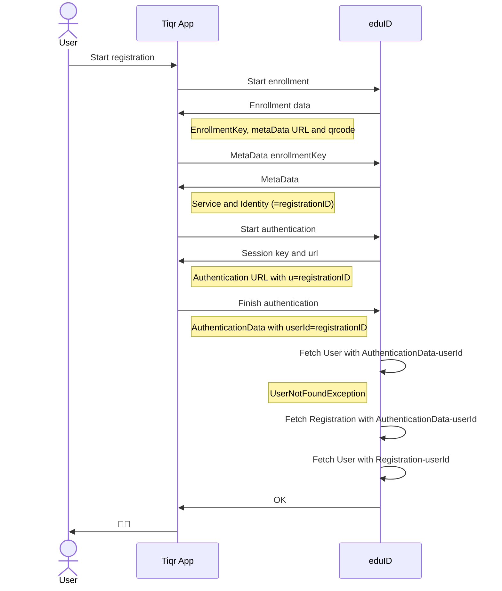

```mermaid
sequenceDiagram
    actor User
    participant Tiqr App
    participant eduID
    User->>Tiqr App: Start registration
    Tiqr App->>eduID: Start enrollment
    eduID->>Tiqr App: Enrollment data
    Note right of Tiqr App: EnrollmentKey, metaData URL and qrcode
    Tiqr App->>eduID: MetaData enrollmentKey
    eduID->>Tiqr App: MetaData
    Note right of Tiqr App: Service and Identity (=registrationID)
    Tiqr App->>eduID: Start authentication
    eduID->>Tiqr App: Session key and url
    Note right of Tiqr App: Authentication URL with u=registrationID
    Tiqr App->>eduID: Finish authentication
    Note right of Tiqr App: AuthenticationData with userId=registrationID
    eduID->>eduID: Fetch User with AuthenticationData-userId
    Note left of eduID: UserNotFoundException
    eduID->>eduID: Fetch Registration with AuthenticationData-userId
    eduID->>eduID: Fetch User with Registration-userId
    eduID->>Tiqr App: OK
    Tiqr App->>User: 🙏🏻
```
